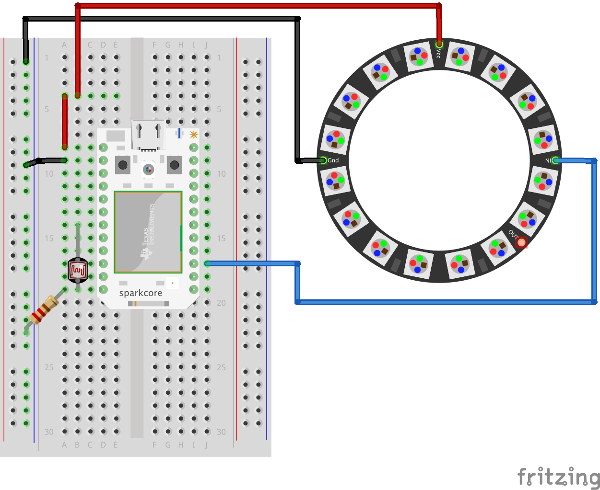
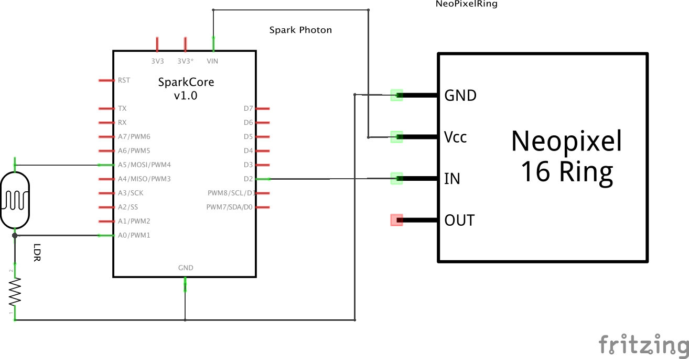
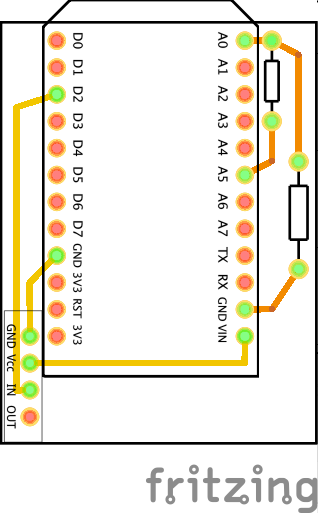

SnowDay
===

####Introduction
Is an Internet Enabled object that searches twitter for a hashtag, and affects a LED in response to the search.

Many thanks to [Mark Woodall](https://github.com/llad) for the Rest Client
[https://github.com/llad/spark-restclient](https://github.com/llad/spark-restclient) And [Technobly](https://github.com/technobly) for the NeoPixel library [SparkCore-NeoPixel](https://github.com/technobly/SparkCore-NeoPixel)

####Components
* 1x Particle Photon
* 1x LED
* 1x Photoresistor

####Code
There are two parts to the project.

1. A Particle sketch
2. Some php scripts

####Schematic

